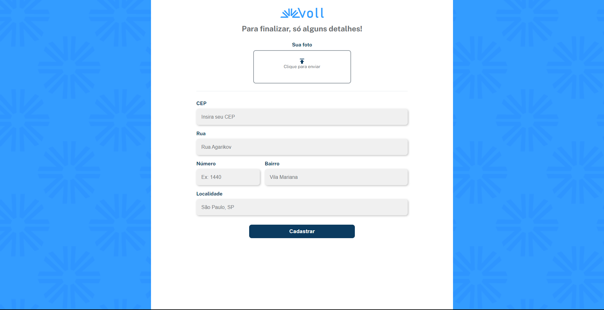

# Voll

Voll med is a clinic specialized in connecting the right professionals to clients. It is currently in the development phase of its website and app, which has a large number of features. One of these features is your forms, which need to have some type of validation of your customers' data.



## 🔨 Project features

At this stage of development, Voll has the following features:

- Patient registration form
- Registration form for specialist doctors

You can find the [Figma for this application here](https://www.figma.com/file/hsW25fAq36IDzzIxBtpgCd/Voll.med-%7C-React-Hook-Forms?type=design&node-id=57-1388&mode=design).

## ✔️ Techniques and technologies used

The project uses the following technologies and libraries:

- `React` - JavaScript Framework
- `Vite` - Build tool for rapid development
- `TypeScript` - Main programming language
- `React Hook Forms` - React form validation library
- `Zod` - Library for creating validation schemes
- `Styled Components` - Styling tool for our project
- `Figma` - For project prototyping

And much more...

## 🛠️ Open and run the project

To run the Meteora project in your local environment, follow these steps:

1. Make sure you have Node.js installed on your machine. We use version 20.10.0

2. Download the project repository.

3. Extract the files to a folder of your choice.

4. Navigate to the folder in question via terminal (cmd):

```bash
cd react-forms-zod
```

5. Install dependencies using npm:

```bash
npm install
```

6. Start the project locally:

```bash
npm run dev
```

## 📚 More information about the Project

Did you like the project and want to know more?

The design and prototype of this project can be found [here](https://www.figma.com/file/hsW25fAq36IDzzIxBtpgCd/Voll.med-%7C-React-Hook-Forms?type=design&node-id=57-1388&mode= design).
Enjoy Voll's development and improvement!